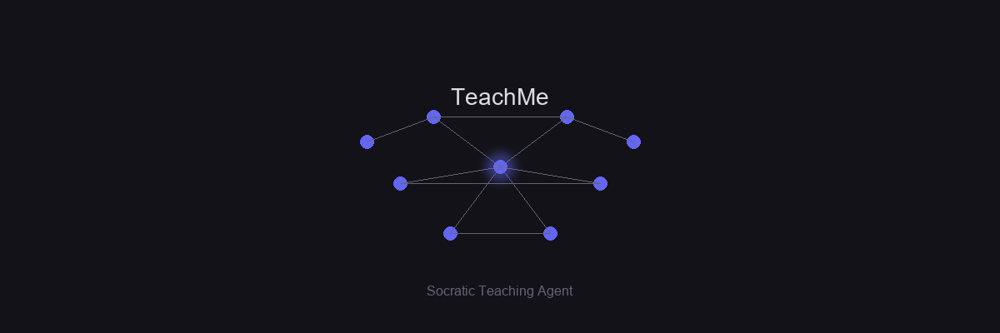
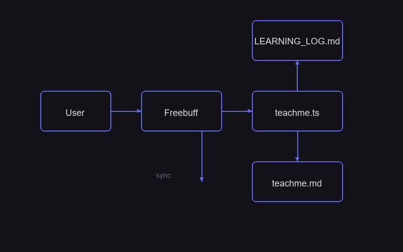
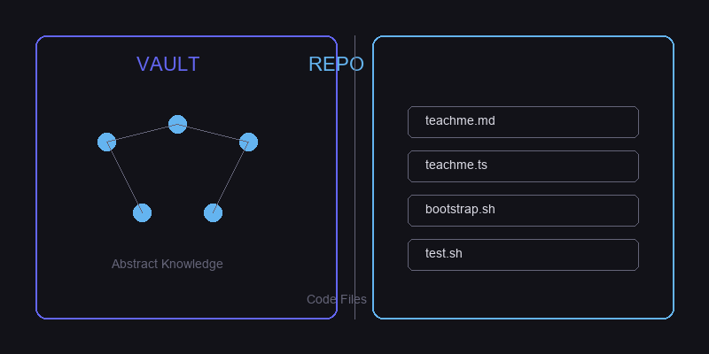
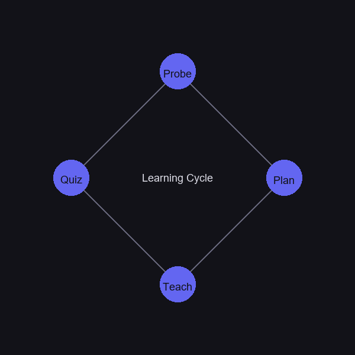
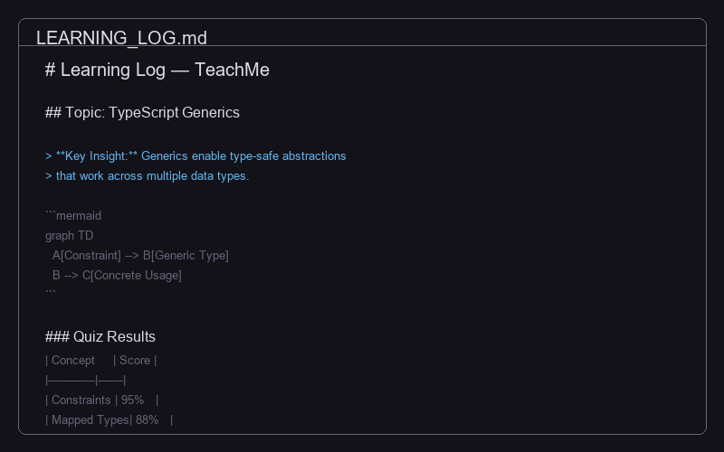

[](README.md) [](README.es.md)



 [](https://github.com/nicholasgriffintn/Freebuff) [](LICENSE)

> **The one-liner:** Nothing to memorize — the agent builds a dependency graph in your head. Unconditional truths first, each fact hanging from what you already understand, and a 2-question quiz after every block to confirm the node is solid before building on top.

## Table of Contents

- [Prerequisites](#prerequisites)
- [Quick Start](#quick-start)
- [Architecture](#architecture)
- [Two Modes](#two-modes)
- [Learning Flow](#learning-flow)
- [Vault Output](#vault-output)
- [Customization](#customization)
- [Scripts & Tools](#scripts--tools)
- [Testing](#testing)
- [Versioning](#versioning)
- [Changelog](#changelog)
- [Contributing](#contributing)

## Prerequisites

- **Node.js** ≥ 18 (Freebuff needs it — the bootstrap script installs it if missing)
- **Freebuff** installed ([repo](https://github.com/nicholasgriffintn/Freebuff))
- **Obsidian** (optional): for rendering Mermaid, LaTeX, and callouts in the learning vault

## Quick Start

### Option A — One command (recommended)

```bash
cd teachme
./bootstrap.sh
```

One command, everything ready: installs Node.js and Freebuff if missing, copies the agent to `~/.agents/teachme.ts`, verifies syntax and `.md ↔ .ts` sync, and runs integrity tests. It is idempotent — run it as many times as you want.

Other commands:

```bash
./bootstrap.sh --check      # Verify only (no changes)
./bootstrap.sh --uninstall  # Remove the agent
```

### Option B — Manual installation

```bash
# 1. Create global folder if it doesn't exist
mkdir -p ~/.agents

# 2. Copy the agent
cp .agents/teachme.ts ~/.agents/

# 3. Verify syntax
node --check ~/.agents/teachme.ts
```

### Verification

1. Open Freebuff in this folder:
   ```bash
   cd teachme
   freebuff
   ```
2. Type:
   ```
   @teachme teach me what a hash is
   ```
3. If it responds and starts the probe → installed correctly

### Repository Structure

```
~/.agents/
└── teachme.ts          ← the active agent (Freebuff loads it)

teachme/
├── .agents/
│   └── teachme.md      ← canonical agent source
├── bootstrap.sh              ← one-command install
├── install.sh                ← classic install (agent only)
├── sync-md-ts.sh             ← syncs .md → .ts
├── test.sh                   ← integrity tests
├── templates/                ← vault schema
├── LEARNING_LOG.md           ← your data (gitignored)
├── visuals/                  ← your data (gitignored)
├── docs/images/              ← README visual assets
└── hash-vault/               ← example vault (gitignored)
```

> **Note:** `LEARNING_LOG.md`, `visuals/`, and `*-vault/` are **your learning data** — they are gitignored and never pushed to GitHub. What gets published is the system: agent, scripts, templates, and docs.

## Architecture



Freebuff is the runtime. TeachMe is the agent it loads. The flow is:

1. Freebuff starts a session in a folder
2. It discovers `~/.agents/teachme.ts` and loads the agent
3. The agent detects the mode (VAULT or REPO) from the current directory
4. It probes your level, builds a plan, teaches block by block
5. Everything is written to `LEARNING_LOG.md` with Mermaid diagrams in `./visuals/`

## Two Modes



The agent detects which mode automatically based on the current directory.

| | **VAULT** | **REPO** |
|---|---|---|
| **Purpose** | Learn a general topic (HTTPS, hashes, networking…) | Absorb the code of an existing project |
| **How to invoke** | `@teachme teach me X` | `@teachme I want to absorb this codebase` |
| **Where to open Freebuff** | In this folder (`teachme`) | Inside the repo you want to learn |
| **What it reads** | Agent knowledge + web verification | Repo files (`read_files`) |
| **How it teaches** | Abstract concepts + Mermaid | Literal snippets (`file:line`) |
| **Where the log lands** | `teachme/LEARNING_LOG.md` | In the repo (or centralized vault) |

> **How does it know which mode?**
> **Code-first signals:** if the current directory has a `package.json`, `go.mod`, `Cargo.toml`, `pyproject.toml`, or a `.git` with source code → **REPO MODE**. If it is not a code project but a `LEARNING_LOG.md` with our frontmatter already exists → **VAULT MODE** (resuming a session). If neither code nor log exists → **VAULT MODE** (new session).

## Learning Flow



Every session follows the same cycle:

| Phase | What happens | What you do |
|---|---|---|
| **Probe** | 2-question rounds to map your level + an objective question | Answer honestly — "I don't know" is valuable info, not a failure |
| **Plan** | Proposes curriculum + dependency map (Mermaid) | Review and give the OK (or adjust scope) |
| **Teach** | Block by block: motivate → establish → connect → **2-question quiz** | Attempt the quiz seriously; if you fail, the node is repaired before moving on |

## Vault Output



When the session ends, everything is in `LEARNING_LOG.md`:

- Full lesson with Mermaid diagrams
- Quiz results (question + your answer + verdict ✓/✗)
- Dependency graph showing which nodes are solid and which need reinforcement

Open the folder in Obsidian and the log renders with native Mermaid, LaTeX, and callouts.

> **New session:** Agents load at session start. After installing or editing `teachme.ts`, open a **new** Freebuff session for changes to take effect.

## Customization

Edit the canonical source, then sync:

1. Edit `.agents/teachme.md` (the canonical source)
2. Run `./sync-md-ts.sh` (copies changes from `.md` to the global `.ts`)
3. Open a **new** Freebuff session

> **Do not edit `~/.agents/teachme.ts` directly** — it will be overwritten on the next sync.

## Scripts & Tools

| Script | What it does |
|--------|--------------|
| `./bootstrap.sh` | One-command install (Node + Freebuff + agent + verification) |
| `./bootstrap.sh --check` | Verify installation without changes |
| `./install.sh` | Install agent only (classic) |
| `./install.sh --check` | Verify installation |
| `./sync-md-ts.sh` | Sync `.md` → `.ts` |
| `./sync-md-ts.sh --dry-run` | Show what would be synced |
| `./test.sh` | Run integrity tests |

## Testing

```bash
./test.sh    # Verify files, syntax, configuration, and scripts
```

Expected result:

```
✓ Passed: 38
✗ Failed: 0
○ Skipped: 0
```

## Versioning

The agent uses semantic versioning. The canonical version lives in `.agents/teachme.md` frontmatter (`version:`) and is stamped into the installed `.ts` header on sync.

```bash
./bootstrap.sh --version      # Show source and installed versions
./sync-md-ts.sh               # Sync and stamp the version
```

Policy (details in `CHANGELOG.md`):

- **PATCH** — wording fixes with no behavior change.
- **MINOR** — new rule or feature.
- **MAJOR** — breaking change (log format, process).

When editing the agent: bump `version:` in frontmatter, add an entry in `CHANGELOG.md`, sync, and open a new Freebuff session.

## Changelog

See [CHANGELOG.md](CHANGELOG.md) for the full history.

## Contributing

Contributions are welcome. Fork the repo, create a feature branch, and open a pull request. Run `./test.sh` before submitting.

---

> **Bilingual sync note:** Keep both language versions in sync when editing content. See [README.es.md](README.es.md) for the Spanish version.
