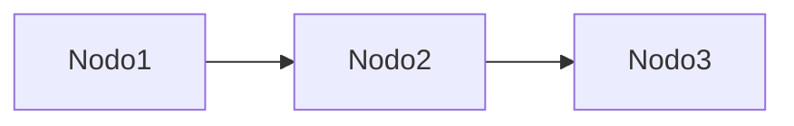

# Esquema Rápido de Repaso — Guía para teachme

Schema compacto (~60 líneas) para un esquema de repaso de un solo archivo.

---

## Frontmatter

```yaml
---
title: Esquema — <Tema>
course: <Curso o contexto>
block: <Bloque del plan>
node: <Nodo principal>
type: esquema
status: consolidado
tags:
  - esquema
  - <tema>
---
```

## Secciones (en este orden)

<!-- Rellenar cada sección根据 la sesión. Sin code fences extra en el archivo final. -->

# Esquema — <Tema>

> Nota de repaso rápido. Teoría completa: [[<log-o-nota-relacionada>]]

## La idea en una frase
<!-- Sintetizar desde la verdad nuclear del plan -->
> <Una frase incondicional que resuma la idea central>

## Las piezas
<!-- Una fila por nodo enseñado: nombre / qué-es / analogía -->
| Pieza | Qué es | Analogía |
| --- | --- | --- |
| **<Pieza>** | <Definición, 1 línea> | <Analogía, 1 línea> |

## El flujo
<!-- Reutilizar mermaid del plan. Flowchart LR, ≤7 nodos -->


## Sí / No (trampas frecuentes)
<!-- Compilar desde distractores del quiz y misconcepciones -->
- ✅ <Afirmación correcta>
- ❌ <Trampa: confusión frecuente>

## Flashcards #flashcards
<!-- Recoger tarjetas de veredictos, incluyendo "No lo sé" -->
- <Pregunta> :: <Respuesta correcta>

## Estado
- [x] Consolidado (quiz X/Y, YYYY-MM-DD)

---

## Reglas

- Un solo archivo (~60 líneas), compacto, no un vault completo.
- Neutral Spanish en todo el contenido (sin voseo).
- Mermaid válido: flowchart LR, ≤7 nodos, etiquetas cortas.
- Flashcards en formato `pregunta :: respuesta` bajo `#flashcards`.
- Recomendado para temas cortos (1–3 bloques del plan).
