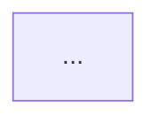

# esquema-schema.md — Schema compacto del esquema rápido de repaso

> **Nota:** Este archivo es un extracto fiel de `SKILL.md` (sección «Esquema rápido de repaso»). La fuente de verdad es SKILL.md; si hay divergencia, gana SKILL.md.

Un solo archivo `<tema>-esquema.md` (~60 líneas) que compila lo esencial de la
sesión. **Recomendado para temas cortos (1–3 bloques).**

## Estructura del archivo

```markdown
# Esquema — <Título>

> Nota de repaso rápido. Teoría completa: [[<nombre-teoria-sin-extension>]]

## La idea en una frase
> <1 frase>

## Las N piezas
| Pieza | Qué es | Analogía |

## El flujo (memorizar el orden)


## Sí / No (trampas frecuentes)
- ✅ <correcto>
- ❌ <trampa vecina>

## Flashcards #flashcards
- <pregunta>? :: <respuesta>.
- <pregunta>? :: <respuesta>.

## Estado
- [ ] En curso | [x] Consolidado (quiz x/y, YYYY-MM-DD)
```

## Proceso de generación

1. **La idea en una frase**: sintetiza la verdad nuclear del tema desde la
   motivación del plan / raíz del mapa de dependencias.
2. **Las piezas**: una fila por nodo enseñado — nombre / qué-es / analogía
   cotidiana (tabla de 3 columnas).
3. **El flujo**: reutiliza o adapta el mermaid del plan (flowchart LR, ≤7 nodos,
   etiquetas cortas).
4. **Sí / No**: compila pares de verificación desde los distractores del quiz
   y las misconcepciones surfaced durante la enseñanza (un ✅ correcto vs un
   ❌ vecino confundible).
5. **Flashcards**: recoge todas las tarjetas de los veredictos de quiz de la
   sesión, incluyendo las de "No lo sé" (son las que más repaso necesitan).
6. **Escribe** una nota-esquema `NN-nombre-esquema.md` por nodo junto a su teoría `NN-nombre.md` en la carpeta `NN-NombreBloque/` (no en raíz suelta ni junto al log).
7. **Verifica** antes de declarar listo: archivo existe y no está vacío,
   mermaid tiene sintaxis válida (flowchart LR, nodos cerrados, sin huérfanos),
   flashcards en formato `<pregunta>? :: <respuesta>.` bajo `## Flashcards #flashcards`.
