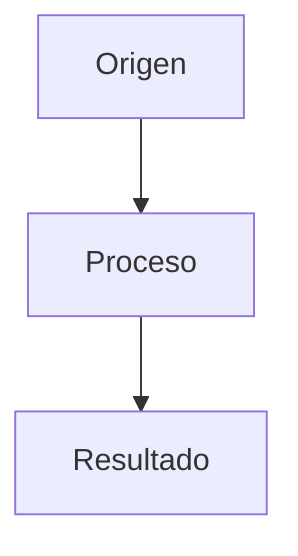
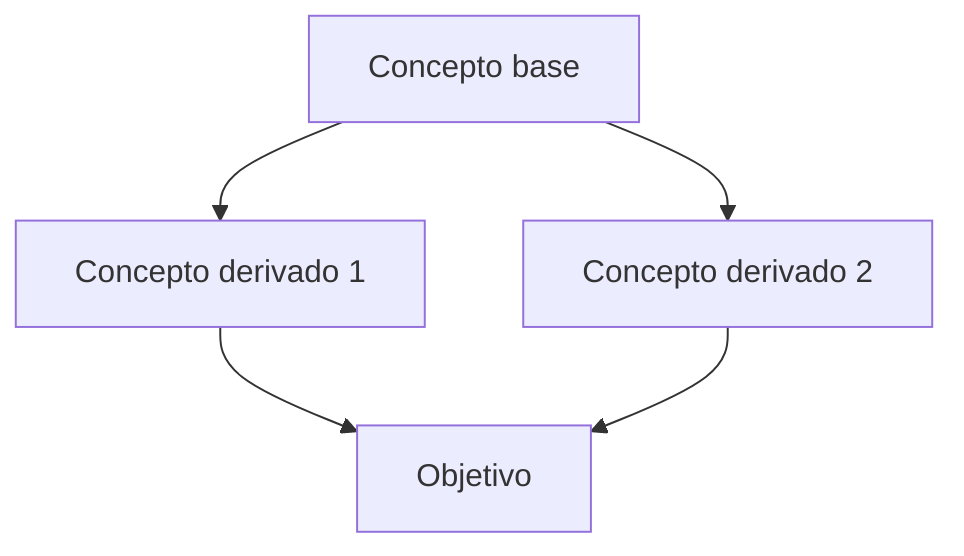

# Vault Schema — Guía para teachme

Schema completo para generar vaults de Obsidian. Inspirado en el patrón LLM Wiki de Karpathy.

---

## Estructura del vault

```
<tema>-vault/
├── index.md              ← catálogo de todo el vault
├── log.md                ← registro cronológico de cambios
├── Home.md               ← mapa de dependencias + ruta recomendada
├── README.md             ← instrucciones de uso
├── notas/                ← conceptos del tema
├── entidades/            ← personas, proyectos, herramientas, servicios
├── comparaciones/        ← A vs B
└── flashcards/           ← repaso espaciado
```

---

## Frontmatter estándar

Todas las páginas llevan frontmatter YAML:

```yaml
---
tags:
  - <tipo>       # concepto | entidad | comparacion
  - <tema>       # nombre del tema en minúsculas
created: YYYY-MM-DD
updated: YYYY-MM-DD
source: teachme
status: draft | stable
---
```

**Reglas:**
- `tags` siempre incluye el tipo Y el tema
- `created` = fecha de creación
- `updated` = última modificación (se actualiza)
- `source` siempre = "teachme"
- `status`: `draft` durante la lección, `stable` al confirmar con quiz

---

## Tipos de página

### 1. Concepto

Ideas abstractas, definiciones, protocolos, patrones.

**Plantilla:**
```markdown
---
tags: [concepto, <tema>]
created: YYYY-MM-DD
source: teachme
status: draft
---

# <Nombre del concepto>

Definición breve y clara (1-2 líneas).

## Características
- Característica 1
- Característica 2
- Característica 3

## Relación con otros conceptos
- [[notas/...|concepto relacionado]] se relaciona porque...
- [[notas/...|otro concepto]] es diferente en que...

## Diagrama

Fuente: [[visuales/<tema>-<nombre>.mmd]]

## Auto-chequeo
Responde antes de avanzar:
1. ¿Pregunta 1?
2. ¿Pregunta 2?
3. ¿Pregunta 3?

## Siguiente
→ [[notas/siguiente|Siguiente concepto]]
```

### 2. Entidad

Cosas concretas con nombre propio: herramientas, personas, proyectos, servicios, empresas.

**Plantilla:**
```markdown
---
tags: [entidad, <tema>]
created: YYYY-MM-DD
source: teachme
status: draft
---

# <Nombre de la entidad>

## Qué es
Descripción breve de qué es y para qué sirve.

## Características principales
- Característica 1
- Característica 2

## Uso típico
- Caso de uso 1
- Caso de uso 2

## Conceptos relacionados
- [[concepts/...|concepto]] — relación
- [[entidades/...|otra entidad]] — relación

## Enlaces externos
- [Documentación oficial](url)
```

### 3. Comparación

Cuando dos conceptos o entidades son fácilmente confundibles o complementarios.

**Plantilla:**
```markdown
---
tags: [comparacion, <tema>]
created: YYYY-MM-DD
source: teachme
status: draft
---

# <A> vs <B>

## Tabla comparativa

| Aspecto | <A> | <B> |
|---------|-----|-----|
| Aspecto 1 | ... | ... |
| Aspecto 2 | ... | ... |
| Aspecto 3 | ... | ... |

## Cuándo usar cada uno
- **<A>:** cuando necesites...
- **<B>:** cuando necesites...

## Comúnmente confundidos con
- [[notas/...|concepto similar]] — se diferencia en que...

## Páginas relacionadas
- [[notas/A|<A>]]
- [[notas/B|<B>]]
```

---

## Archivos especiales

### index.md

Catálogo actualizado de todo el vault. El agente lo actualiza al crear/modificar páginas.

```markdown
# Índice — <Tema>

Vault generado por teachme. Última actualización: YYYY-MM-DD.

## Conceptos
- [[notas/01 - Concepto 1]] — descripción breve (stable)
- [[notas/02 - Concepto 2]] — descripción breve (draft)

## Entidades
- [[entidades/Entidad 1]] — descripción breve

## Comparaciones
- [[comparaciones/A vs B]] — descripción breve

## Estadísticas
- Total conceptos: X
- Total entidades: Y
- Total comparaciones: Z
- Última actualización: YYYY-MM-DD
```

### log.md

Registro cronológico de cambios. Append-only.

```markdown
# Log — <Tema>

Registro de cambios en el vault.

## [YYYY-MM-DD] create | Vault inicial
- Creado: index.md, Home.md, README.md
- Conceptos: ...
- Entidades: ...
- Comparaciones: ...

## [YYYY-MM-DD] ingest | <fuente>
- Nuevo: [[notas/...]]
- Actualizado: [[notas/...]]

## [YYYY-MM-DD] update | <descripción>
- Modificado: [[notas/...]]
- Razón: ...
```

### Home.md

Mapa de dependencias y ruta recomendada.

```markdown
---
tags: [home, <tema>]
created: YYYY-MM-DD
---

# <Tema> — Vault de estudio

## Mapa de dependencias


Fuente: [[visuales/<tema>-home.mmd]]

## Ruta recomendada

1. [[notas/01 - Concepto base|Concepto base]]
2. [[notas/02 - Derivado 1|Derivado 1]]
3. [[notas/03 - Derivado 2|Derivado 2]]

## Nodos de refuerzo
- [[notas/...|Concepto]] ⭐ (quiz fallado)

## Índice completo
→ [[index|Ver todas las páginas]]
```

### README.md

Instrucciones de uso (genérico para todos los vaults).

```markdown
# Vault de <Tema>

Vault autocontenido para estudiar <Tema>. Generado por @teachme.

## Cómo usar

1. Abrir esta carpeta en Obsidian
2. Empezar por [[Home|Home.md]]
3. Seguir la ruta recomendada
4. Responder auto-chequeos antes de avanzar
5. Repasar flashcards con plugin Spaced Repetition

## Estructura

- `notas/` — conceptos del tema
- `entidades/` — herramientas, proyectos, servicios
- `comparaciones/` — A vs B
- `flashcards/` — repaso espaciado
- `visuales/` — diagramas mermaid
- `index.md` — catálogo de todo
- `log.md` — registro de cambios

## Generado por

@teachme — profesor socrático de Freebuff
```

---

## Reglas de cross-referencing

1. **Al crear una nota**, buscar si existen páginas que deban enlazar a ella
2. **Al modificar una nota**, verificar que los enlaces entrantes sigan siendo correctos
3. **Cada nota** debe tener al menos 1 enlace saliente (siguiente o relacionado)
4. **Cada nota** debe ser enlazada desde al menos 1 otra página (o desde index.md)
5. **Usar rutas explícitas**: `[[notas/01 - Nombre|Texto visible]]`

---

## Reglas de diagramas

1. Máximo **7 nodos** por diagrama
2. Etiquetas **cortas** (1-3 palabras)
3. Un **solo concepto** por diagrama
4. Fuentes Mermaid en `visuales/<tema>-<nombre>.mmd`
5. Embeber el mismo bloque en la nota correspondiente

---

## Flashcards

Archivo: `flashcards/<Tema> - Flashcards.md`

Formato (plugin Spaced Repetition):
```markdown
#flashcards

# <Tema> — Flashcards

## <Subtema>
- Pregunta 1? :: Respuesta 1
- Pregunta 2? :: Respuesta 2
```

Reglas:
- Una tarjeta por pregunta del quiz
- Incluir tarjetas de "No lo sé" (son las que más repaso necesitan)
- Organizar por subtema

---

## Proceso de creación del vault

1. **Estructura**: crear carpetas y archivos base (index.md, log.md, Home.md, README.md)
2. **Contenido**: rellenar notas durante la lección (status: draft)
3. **Quiz**: al confirmar con quiz → status: stable
4. **Index**: actualizar index.md con las nuevas páginas
5. **Log**: añadir entrada en log.md
6. **Flashcards**: crear archivo de tarjetas al final
7. **Verificación**: comprobar enlaces, extensiones, tamaños
