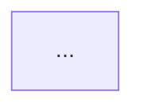

# vault-schema.md — Schema del vault de Obsidian

> **Nota:** Este archivo es un extracto fiel de `SKILL.md` (sección «Estructura del vault» hasta «Proceso de creación»). La fuente de verdad es SKILL.md; si hay divergencia, gana SKILL.md.

## Estructura del vault

```
<vault>/
├── LEARNING_LOG.md              ← índice + estado + bloques de sesión (es el índice, no hay index.md/Home.md/README.md)
├── visuals/                     ← fuentes mermaid .mmd en raíz (en inglés, siempre `visuals/`, nunca `visuales/`)
│   ├── <tema-kebab>-plan.mmd
│   └── <tema-kebab>-b<n>-n<m>.mmd
├── 01-NombreBloque/             ← una carpeta por bloque temático: `NN-NombreEnPascalConGuiones/`
│   ├── NN-nombre-concepto.md          ← teoría (1 nodo = 1 nota)
│   └── NN-nombre-concepto-esquema.md  ← esquema de repaso (1 por nodo, con `type: esquema`)
├── 02-SiguienteBloque/
│   └── ...
└── .obsidian/                   ← no tocar
```

**Reglas:** NO crear `index.md`, `log.md`, `Home.md`, `README.md`, ni subcarpetas `notas/`, `entidades/`, `comparaciones/`, `flashcards/`. El índice vive en `LEARNING_LOG.md`. Cada nodo = formato triple: teoría + esquema + quiz (el quiz vive en el log, no en nota aparte).

## Tipos de página (solo 2)

| Tipo | Archivo | Frontmatter distintivo |
|------|---------|------------------------|
| **teoría** | `NN-nombre-concepto.md` en carpeta del bloque | sin `type`, con `title/course/block/node/status/tags` |
| **esquema** | `NN-nombre-concepto-esquema.md` junto a su teoría | mismo + `type: esquema` |

## Frontmatter estándar — teoría (copiar literal, adaptar valores)

```yaml
---
title: <Título legible>
course: <Curso fijo, ej. AI for Beginners>
block: <B1 — Nombre del bloque>
node: <N1 / B2.1 / ...>
status: en-curso | consolidado
tags:
  - <kebab-case>
  - <kebab-case>
---
```

## Frontmatter estándar — esquema (igual + `type: esquema`)

```yaml
---
title: Esquema — <Título>
course: <Curso fijo>
block: <B1 — Nombre del bloque>
node: <N1>
type: esquema
status: en-curso | consolidado
tags:
  - esquema
  - <kebab-case>
---
```

## Frontmatter de LEARNING_LOG.md (raíz del vault)

```yaml
---
source: learn-teacher
mode: repo | vault
repo: <nombre repo o vacío>
created: YYYY-MM-DD
---
```

## Template teoría (secciones fijas, en este orden)

```markdown
# <Título>

## Idea central
<1 oración + quote `> <frase memorable>`>

## ¿Qué problema resuelve?
<contexto motivacional>

## Las piezas del modelo mental
### <pieza 1>
### <pieza 2>
...

## El proceso completo, sin centrarnos en las cuentas


## Qué no debemos confundir
| Concepto | Qué significa | Qué no significa |

## Conexión con el aprendizaje
## Conexión con los notebooks del repositorio (solo MODO REPO)
## Resumen para recordar
> <frase de cierre>

## Autoevaluación
<3 preguntas abiertas, no quiz graduable>
```

## Template esquema (repaso rápido, en este orden)

```markdown
# Esquema — <Título>

> Nota de repaso rápido. Teoría completa: [[<nombre-teoria-sin-extension>]]

## La idea en una frase
> <1 frase>

## Las N piezas
| Pieza | Qué es | Analogía |

## El flujo (memorizar el orden)


## Sí / No (trampas frecuentes)
- ✅ <correcto>
- ❌ <trampa vecina>

## Flashcards #flashcards
- <pregunta>? :: <respuesta>.
- <pregunta>? :: <respuesta>.

## Estado
- [ ] En curso | [x] Consolidado (quiz x/y, YYYY-MM-DD)
```

## Reglas de cross-referencing (estilo del vault ejemplo)

1. Wikilinks SIEMPRE sin ruta ni extensión: `[[01-neurona-y-evidencia]]`, nunca `[[01-Fundamentos-NN/01-neurona-y-evidencia]]`.
2. Esquema → teoría con banner fijo: `> Nota de repaso rápido. Teoría completa: [[<teoria>]]`.
3. Mermaid inline en la nota (` ```mermaid `) + fuente editable en `visuals/*.mmd` + línea `Fuente: [[visuals/<archivo>.mmd]]` tras el diagrama del log (en notas de teoría el `.mmd` es la fuente, el bloque inline es lo que renderiza Obsidian).
4. Flashcards inline bajo `## Flashcards #flashcards` con formato `<pregunta>? :: <respuesta>.` — nunca carpeta `flashcards/` separada.
5. Callouts: `> [!quote]` estudiante, `> [!question]` quiz, `> [!success]`/`> [!fail]` veredicto, `> [!note]` proceso.
6. Idioma de artefactos: español SIEMPRE salvo que el usuario pida otro explícitamente.
7. Naming: carpetas `NN-NombreBloque/`, teoría `NN-nombre-concepto.md`, esquema `NN-nombre-concepto-esquema.md`, visuals `<tema-kebab>-b<n>-n<m>[-conceptual].mmd`.

## Proceso de creación (formato triple por nodo)

1. **Estructura**: carpeta `NN-NombreBloque/` si no existe + `visuals/` en raíz si falta.
2. **Teoría**: crear `NN-nombre.md` con frontmatter + template teoría (status: en-curso).
3. **Esquema**: crear `NN-nombre-esquema.md` con frontmatter `type: esquema` + template esquema.
4. **Mermaid**: escribir fuente `.mmd` en `visuals/` y embeber el MISMO bloque inline en teoría y esquema.
5. **Quiz**: en `LEARNING_LOG.md` como entrada del nodo con callouts (no nota aparte); al aprobar → teoría y esquema pasan a `status: consolidado` y `## Estado` se marca `[x] Consolidado (quiz x/y, fecha)`.
6. **Índice**: añadir `[[#...]]` en `## Índice` del log (el log ES el índice).
7. **Verificación**: checklist de calidad (ver sección Control de calidad en SKILL.md) antes de decir «listo».
